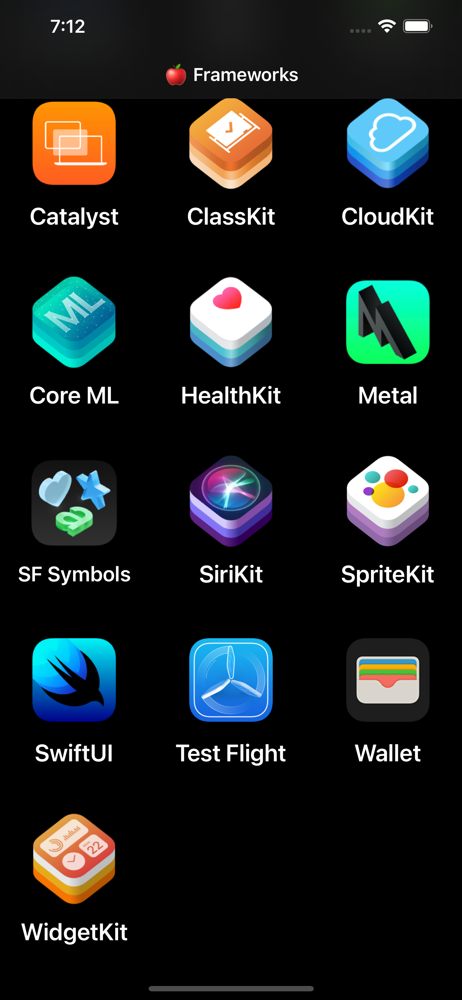
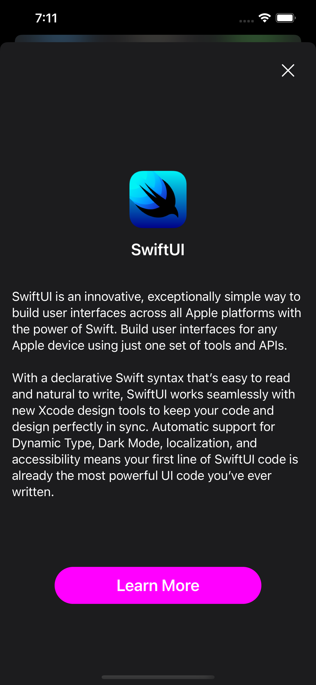
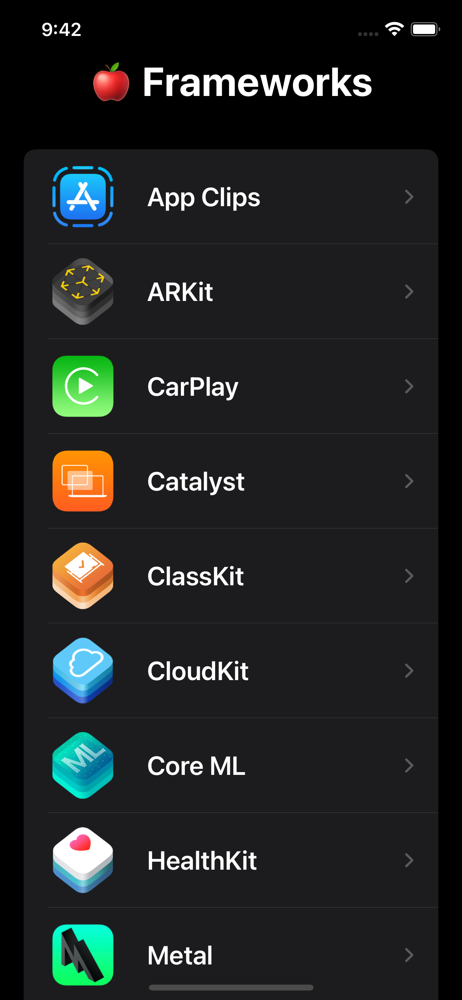

# 
SwiftUI 

 <a href="https://developer.apple.com/swift/" target="_blank" rel="noreferrer"> &nbsp;&nbsp;&nbsp;&nbsp;&nbsp;&nbsp&nbsp; </a>   <a href="https://git-scm.com/" target="_blank" rel="noreferrer">  &nbsp;&nbsp;&nbsp;&nbsp;&nbsp;&nbsp&nbsp;</a>   

 

__Currently studying and updating these projects__

 

## Table of contents

* [Weather App](#weather-app)
* [Apple Frameworks App](#apple-frameworks)
* [Apple Frameworks Version II](#apple-frameworks-version-II)
* [Quick Links](#quick-links)
* [Copyright](#copyright)
* [Contact](#contact)

 

## Weather APP

	
&nbsp;&nbsp;&nbsp;&nbsp;&nbsp;&nbsp&nbsp;&nbsp;&nbsp;&nbsp;&nbsp&nbsp&nbsp;&nbsp;
   

__Topics of research__:

* SwiftUI View Hierarchy
* ZStack, HStack, VStack
* @State, @Binding
* Structs
* Code refactoring

 

__Main Files__

[ContentView](SwiftUI-WeatherApp/SwiftUI-WeatherApp/ContentView.swift)

 

## Apple Frameworks

	
&nbsp;&nbsp;&nbsp;&nbsp;&nbsp;&nbsp&nbsp;&nbsp;&nbsp;&nbsp;&nbsp&nbsp&nbsp;&nbsp;
   

 

	
&nbsp;&nbsp;&nbsp;&nbsp;&nbsp;&nbsp&nbsp;&nbsp;&nbsp;&nbsp;&nbsp&nbsp&nbsp;&nbsp;
   

 

__Topics of research__:

* Model View ViewModel
* Passing data between views
* Grids, Scrollviews, Sheets
* Navigation Views
* LazyVGrid, LazyHGrid
* Dynamic text
* SafariView

 

__Main Files__

[Framework Model](Apple-Frameworks/Apple-Frameworks/Framework.swift)

[Framework DetailView](Apple-Frameworks/Apple-Frameworks/FrameworkDetailView.swift)

[Framework GridView](Apple-Frameworks/Apple-Frameworks/FrameworkGridView.swift)

 

## Apple Frameworks Version II

	
&nbsp;&nbsp;&nbsp;&nbsp;&nbsp;&nbsp&nbsp;&nbsp;&nbsp;&nbsp;&nbsp&nbsp&nbsp;&nbsp;
   
   &nbsp;&nbsp;&nbsp;&nbsp;&nbsp;&nbsp&nbsp;&nbsp;&nbsp;&nbsp;&nbsp&nbsp&nbsp;&nbsp;
   

#### Main Challenge:

* Refactor & change the gridview to a listview

__Topics of research__:

* Lists
* Toolbars
* NavigationLink

 

## Quick Links

### [Click Here to View Android Illustrations](https://github.com/EShenoda/Android-Illustrations)

### [Click Here to View iOS Illustrations](https://github.com/EShenoda/iOS-Game)

### [Click Here to Return to Home Page](https://github.com/EShenoda)

##  Copyright
Private Repo for EmilShenodaDev@gmail.com

All rights reserved: EmilShenoda@FullSailUniversity

## Contact
Created by [Emil Shenoda](mailto:EmilShenodaDev@gmail.com) - feel free to contact me!

[Back to top](#Table-of-contents)